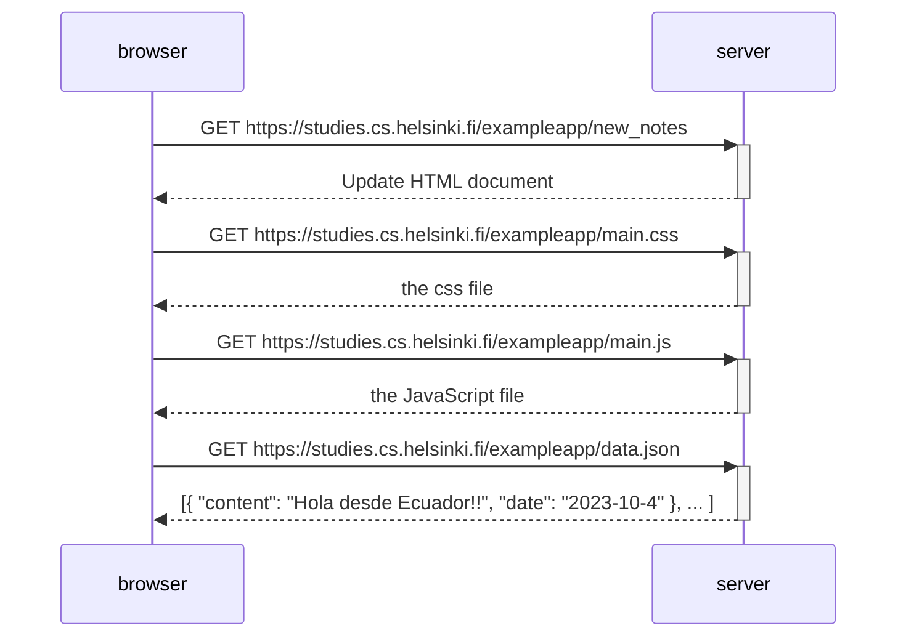

## Diagram

```mermaid
sequenceDiagram;
    participant browser
    participant server

    browser->>+server: GET https://studies.cs.helsinki.fi/exampleapp/new_notes;
    server-->>-browser: Update HTML document
    
    browser->>+server: GET https://studies.cs.helsinki.fi/exampleapp/main.css
    server-->>-browser: the css file
    
    browser->>+server: GET https://studies.cs.helsinki.fi/exampleapp/main.js
    server-->>-browser: the JavaScript file
    
    browser->>+server: GET https://studies.cs.helsinki.fi/exampleapp/data.json
    server-->>-browser: [{ "content": "Hola desde Ecuador!!", "date": "2023-10-4" }, ... ]
  
```

