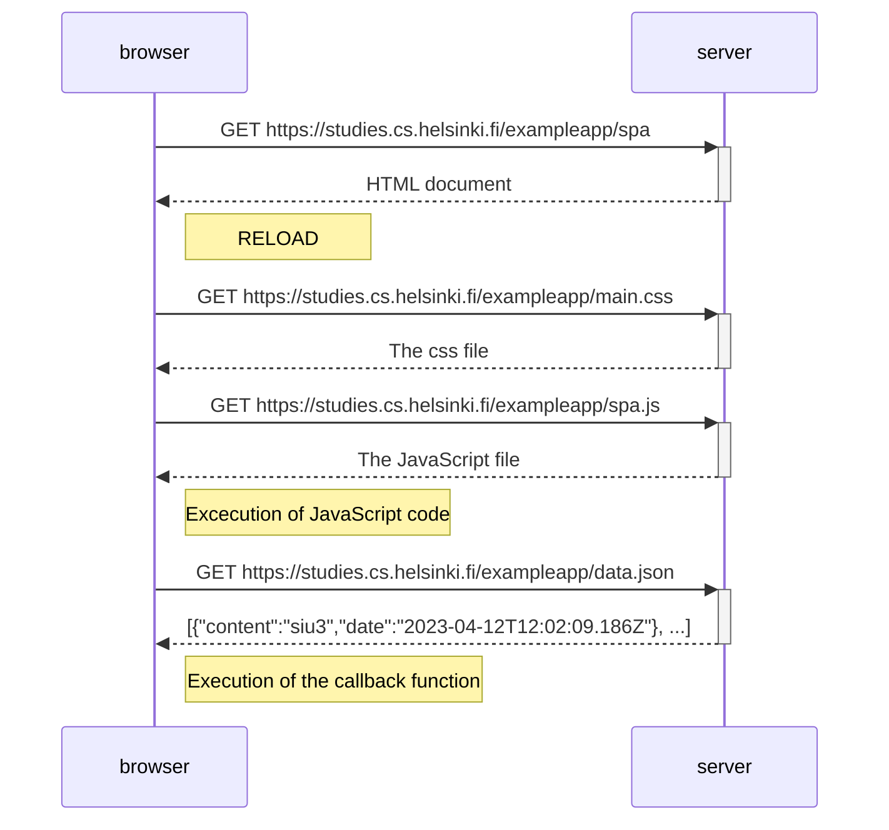

## Diagram 2

```mermaid
sequenceDiagram;
    participant browser
    participant server

    browser->>+server: GET https://studies.cs.helsinki.fi/exampleapp/spa;
    server-->>-browser: HTML document
    Note right of browser: RELOAD
    
    browser->>+server: GET https://studies.cs.helsinki.fi/exampleapp/main.css
    server-->>-browser: The css file
    
    browser->>+server: GET https://studies.cs.helsinki.fi/exampleapp/spa.js
    server-->>-browser: The JavaScript file
    Note right of browser: Excecution of JavaScript code
    
    browser->>+server: GET https://studies.cs.helsinki.fi/exampleapp/data.json
    server-->>-browser: [{"content":"siu3","date":"2023-04-12T12:02:09.186Z"}, ...]
    Note right of browser: Execution of the callback function
    
  
```
