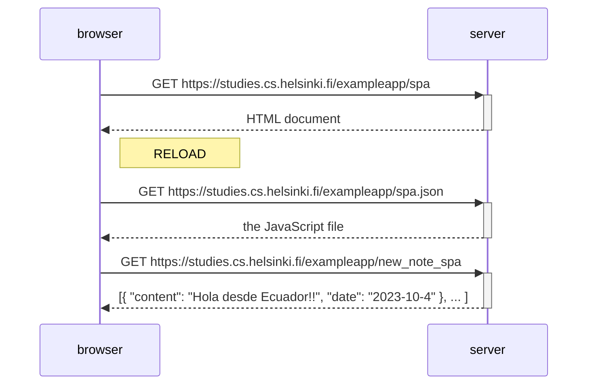

## Diagram 3

```mermaid
sequenceDiagram;
    participant browser
    participant server

    browser->>+server: GET https://studies.cs.helsinki.fi/exampleapp/spa;
    server-->>-browser: HTML document
    Note right of browser: RELOAD
         
    browser->>+server: GET https://studies.cs.helsinki.fi/exampleapp/spa.json 
    server-->>-browser: the JavaScript file
    
    browser->>+server: GET https://studies.cs.helsinki.fi/exampleapp/new_note_spa
    server-->>-browser: [{ "content": "Hola desde Ecuador!!", "date": "2023-10-4" }, ... ]
  
```
